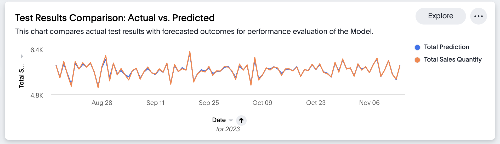
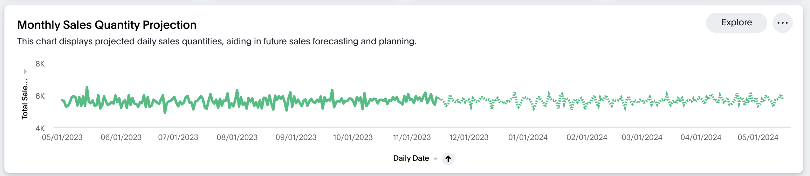
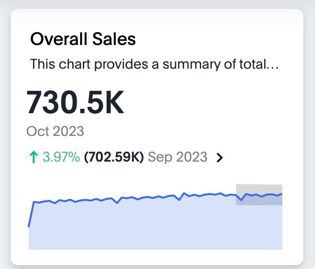
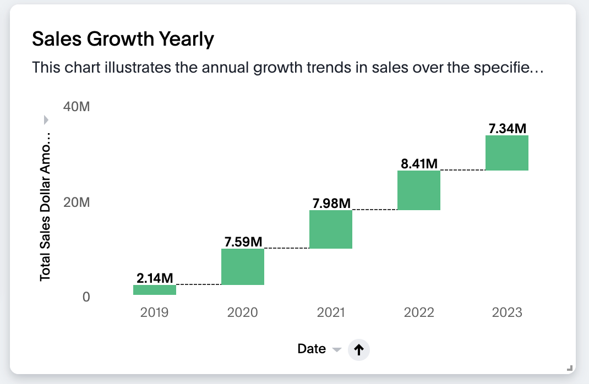
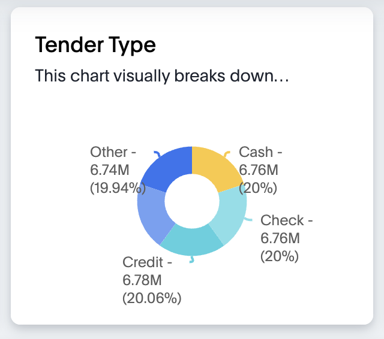
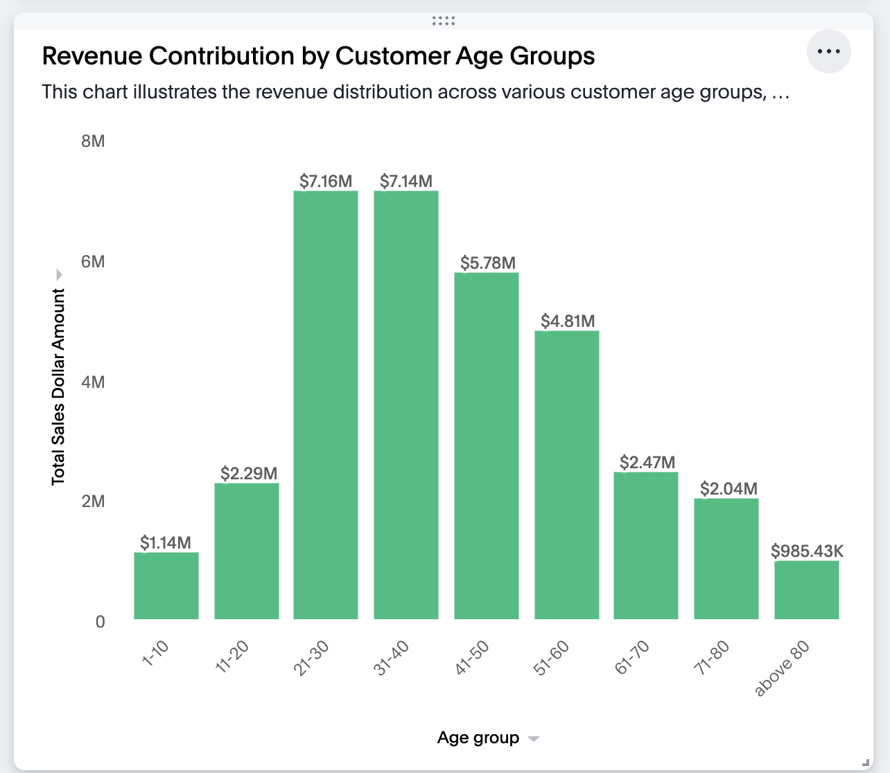
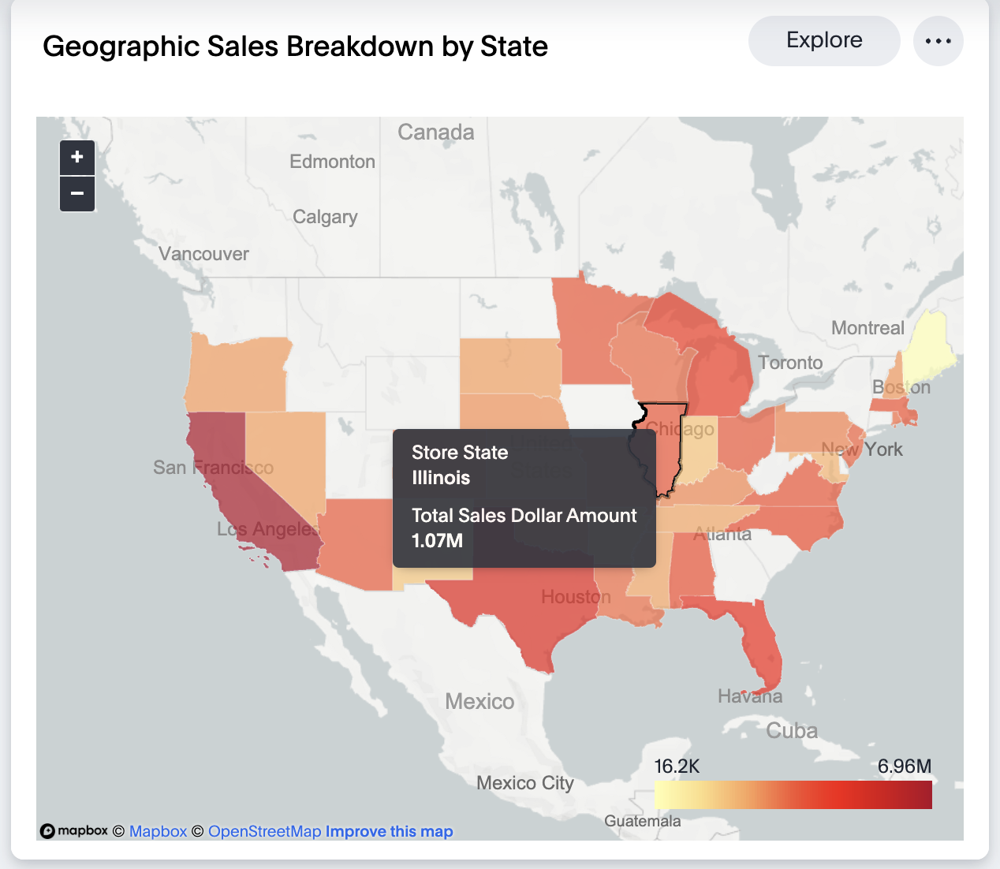

Sales forecasting leverages historical data and market trends to estimate future sales, providing invaluable insights that enable businesses to optimize production, inventory, marketing, and financial planning. By reducing uncertainty, sales forecasting allows companies like FMCG stores to align operations with expected demand, set realistic goals, and make well-informed decisions to drive growth. This summary outlines the value of sales forecasting and introduces an upcoming real-world example that will demonstrate the key techniques used to build forecasting models that transform historical data into accurate predictions of future sales.

Stick with me to see a real-world example of building a sales forecasting model for Fast Moving Consumer Goods stores. I'll walk through the key steps and show you how historical data and market trends can predict future sales. It's super interesting to see these models in action - let's get started!

## Overview:
We forecasted future retail sales using Snowflake's cloud data platform, Snowpark for Python data analysis, and an XGBoost model to generate accurate predictions. By leveraging Snowflake's infrastructure and ThoughtSpot's AI-powered analytics, we seamlessly generated sales forecasts for the next six months. This project demonstrated how advanced data science techniques combined with Snowflake and ThoughtSpot can extract powerful insights from data to guide key business decisions and dramatically improve sales forecasting.

## Approach
First, we connected to the Snowflake database using Snowpark Python. This let us easily access all the data we needed.

Then we grabbed a historical sales dataset with info on sales and store demographics from different locations. This dataset had everything we needed to start digging in.

We cleaned up the data, got it into a nice Pandas DataFrame, and organized it around the 'Transaction_Date'. This made the data much easier to work with.

We decided to use XGBoost since it's great for problems like sales forecasting. We spent some time tuning it to fit our data just right - tweaking things like the learning rate and number of estimators.

### Actual vs Time Series Forecasting Predicted Line Chart: The reality check! Compare what we expected with what actually happened.

To streamline training, we set up a Stored Procedure in Snowflake to re-train the model efficiently.

Then came the fun part - testing the model on 3 months of data to see how well it forecasted sales. The results were looking good! 

### Forecast : The crystal ball of charts! Check out where the sales ship is sailing. 

Now our XGBoost model is ready to start forecasting sales for the next 6 months. This will give us crucial insights to make better decisions.

Alright, buckle up! 🚀 Here's a sneak peek into our sales voyage with some awesome charts:

### Overall Sales : The KPI chart unveils insights into the sales performance. 

### Yearly Sales Growth  : This chart spills the beans on how sales have grown, step by step.

### Tender Type : Where's the money coming from? This pie chart gives breakdown of the revenue sources.

### Revenue Distribution by customer age group: Find out the revenue break down by age groups with this chart.

### Geographic Sales Breakdown by State: Ready for a state-by-state adventure? This chart maps out the sales journey across different regions.

## Guide to use .tml files
For step-by-step instructions on how to import .tml files into your ThoughtSpot cluster please refer [How to use TML files](https://docs.thoughtspot.com/cloud/latest/scriptability#_how_to_use_tml_files)

